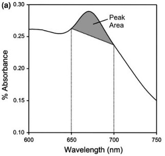

```{r, echo=FALSE, results='hide', message=FALSE}
library(jezioro)
```

The `jezioro` package is a collection of functions and datasets intended for use by members of the Paleoecological Environmental Assessment and Research Laboratory (PEARL). The package is maintained Adam Jeziorski, and contains contributions from Adam Jeziorski, Joshua Thienpont, and Andrew Labaj. If you have any suggestions for its improvement please let us know.

The package includes the following functions (along with example data to illustrate their use):  

- `cladCount`: determine the number of individuals (and their relative abundances) represented in raw cladoceran subfossil data
- `interpDates`: interpolate dates for the undated intervals of a dated sediment core
- `vrsChla`: infer lake sediment chlorophyll *a* concentrations from visible reflectance measurements
- the 'binford' functions collectively calculate ^210^Pb dates for a sediment core using the methods described in Binford 1990, Schelske 1994, and Appleby 2001
    - `binfordRho`: determine water content and dry sediment density for freeze-dried intervals of a sediment core
    - `binfordActivity`: calculate ^210^Pb, ^137^Cs, and ^214^Bi activities corrected for the efficiency of the gamma counter
    - `binfordDates`: use the unsupported fraction of ^210^Pb activity in sediment samples to calculate sediment ages via the Constant Rate of Supply (CRS) model
- the 'wiltse' functions test for homogeneity and coherence within a dataset, they are slightly modified versions of the 'brien' and 'decompose' functions described in Brendan Wiltse's 2014 PhD thesis
    - `wiltseBrien`: perform the Brien test (Brien et al. 1984) on variables contained within a data frame
    - `wiltseDecompose`: build upon the Brien test by identifying homogenous and coherent subsets within the correlation matrix

The package also contains some commonly used calibration sets to facilitate the construction of transfer functions for application to individual sediment cores:

- `tpHall1996`: diatom-inferred TP calibration set of 54 south-central Ontario lakes described in Hall and Smol (1996)
- `vwhoQuinlan2010`: dipteran-inferred VWHO calibration set of 54 south-central Ontario lakes described in Quinlan and Smol (2001; 2010)
<br>
<br>

# Functions
## cladCount
`cladCount` determines the maximum number of individuals represented in raw counts of cladoceran subfossils.

In paleolimnological cladoceran analyses, all remains (carapaces, headshields, ephippia,  postabdominal claws, etc.) should be tabulated seperately, with only the most frequently encountered remain for each taxon used to estimate its abundance (Korhola and Rautio 2001). `cladCount` is a function to quickly calculate the maximum number of individuals represented in appropriately formatted raw counts of subfossils.

Input data must contain the taxon name and subfossil name in the first two columns (respectively), with each subsequent column a sample/interval. If a taxon can be represented by more than one subfossil type, the 'Taxon' cell should be left blank from the second row onwards (these blank cells are how the function identifies the number of subfossils present for each taxon).

The required format of `cladCount` input data is illustrated by `cladCountInput`:
```
data(cladCountInput)
```
```{r, echo=FALSE, results='asis'}
data(cladCountInput)
knitr::kable(head(cladCountInput[,1:6], 10), row.names=F)
```


The largest number of individuals possibly represented by all the subfossils for a particular taxon is identified by attributing the following numbers of each subfossil to an individual (rounding up in the case of 'half-individuals'; Korhola and Rautio, 2001):

- Headshield (1)
- Carapace (2)
- PA Claw (2) 
- Postabdomen (1)
- Mandible(2)
- Caudal Furca (2)
- Exopodite Segment (2)
- Basal Exp Segment (2)
- Exp Segment 2 (2)
- Exp Segment 3 (2)
- Antennule (2)
- Tail Stem (1)

The output of `cladCount` is controlled by three arguments (*percCutoff*, *sampleCutoff*, and *outputType*):

- *percCutoff*  (defaults to 2): minimum relative abundance (i.e. %) required for a taxon to be included in the reduced subset ('gt' - abbreviation of 'greater than')
- *sampleCutoff* (defaults to 2): the minimum number of samples a taxon must be present in with at least a relative abundance of percCutoff for inclusion in the reduced subset ('gt')
- *outputType* (defaults to 'indiv'): the format of the output, either individuals ('indiv'), relative abundance ('perc'), or the relative abundances of only those taxa that meet the *sampleCutoff* and *percCutoff* criteria ('gt') 

For example, to return the number of individuals for all taxa present in the dataset:
```
data(cladCountInput)
cladCount(cladCountInput)
```

Similarly, to return the relative abundances of only those taxa with greater than 4% abundance in at least 2 samples:
```
data(cladCountInput)
cladCount(cladCountInput, percCutoff=4, sampleCutoff=2, outputType='gt')
```
#### References
Korhola A, Rautio M (2001) 2. Cladocera and other branchiopod crustaceans. In: Smol JP, Birks HJB, Last WM (eds.) Tracking Environmental Change Using Lake Sediments. Volume 4: Zoological Indicators. Kluwer Academic Publishers, Dordrecht, The Netherlands, pp 4-41
<br>
<br>

## interpDates
`interpDates` interpolates dates for any undated intervals in a sediment core from the midpoint and age of the dated intervals, as well as the sectioning resolution.

Input data must contain two columns, and the argument *intervalWidth* is used to specifiy the sectioning resolution:

- Column 1: midpoint depth of the dated interval
- Column 2: date of the interval

The required format of `interpDates` input data:
```{r, echo=FALSE}
interpDatesInput <- cbind(c(0.25, 4.25, 8.25, 18.25), c(2017, 2000, 1950, 1850))
colnames(interpDatesInput) <- c("Midpt", "Age")
interpDatesInput
```

The output of `interpDates` is modified by a single argument (*intervalWidth*):

- *intervalWidth*  (defaults to 0.5): a single numeric value is used to indicate a constant sectioning resolution (e.g. the default value assumes the entire core was section at 0.5cm intervals). For a variable sectioning resolution, change *intervalWidth* to a vector providing the width of each interval in the core

Three different interpolation methods are used to determine the dates:

- 'connectTheDotsDates' are calculated from straight lines between sequential date pairs
- 'linearDates' are calculated by fitting a straight line through all dated intervals
- 'polynomialDates' are calculated by fitting a 2nd order polynomial line through all dated intervals

For example, to return the interpolated dates from all 3 methods (as well as a plot comparing the two fitted lines) for a core with four dated intervals and a constant sectioning resolution of 0.5cm:
```
interpDates.input <- cbind(c(0.25, 4.25, 8.25, 18.25), c(2017, 2000, 1950, 1850))
interpDates(interpDates.input)
```
```{r, echo=FALSE, fig_align= "center"}
interpDates.input <- cbind(c(0.25, 4.25, 8.25, 18.25), c(2017, 2000, 1950, 1850))
temp <- interpDates(interpDates.input)
```

Similarly, to return interpolated dates for a core with four dated intervals sectioned at a 0.5cm resolution for the first 10 intervals, and then a 1.0cm resolution for the next 10 intervals:
```
interpDates.input <- cbind(c(0.25, 4.25, 8.5, 13.5), c(2017, 2000, 1950, 1850))
intervalWidth <- c(rep(0.5, 10), rep(1.0, 10))
interpDates(interpDates.input, intervalWidth)
```
For more involved approaches to the estimation of age-depth relationships consult Blaauw and Heegaard (2012).

#### References
Blaauw M, Heegaard E (2012) 12. Estimation of age-depth relationships. In: Birks HJB, Lotter AF, Juggins S, Smol JP (eds.) Tracking Environmental Change Using Lake Sediments. Volume 5: Data Handling and Numerical Techniques. Springer, Netherlands, pp 379-413
<br>
<br>

## vrsChla
`vrsChla` infers chlorophyll *a* concentrations of sediments from spectral measurements of absorbance at wavelengths between 650-700 nm, following the approach described in Wolfe et al. (2006) and Michelutti et al. (2010), and reviewed in Michelutti and Smol (2016).

The technique uses a simple linear predictive model to infer sedimentary chlorophyll *a* concentrations (along with its primary degradation products, pheophytin *a* and pheophorbide *a*) from the absorbance peak centered on 675nm following the equation:

$$[\mbox{chlorophyll }\textit{a } + \mbox{ derivatives}] = 0.0919 · \mbox{peak area}_{\textit{ 650-700 nm}} + 0.0011$$




Input data must contain 27 columns:

- Column 1: midpoint depth of the sediment interval
- Columns 2-27: values from the spectrophotometer for wavelengths 650-700 nm, measured every 2 nm

The required format of `vrsChla` input data is illustrated by `vrsChlaInput`:
```
data(vrsChlaInput)
```
```{r, echo=FALSE}
data(vrsChlaInput)
head(vrsChlaInput[,1:6], 10)
```

**NOTE:** When using the Model 6500 series Rapid Content Analyzer at PEARL, the necessary values are contained in the 'spectra' tab of the excel file output (although they must be transposed). Ensure cells are formatted to 15 decimal places to avoid small rounding errors.

For example, to determine the chlorophyll *a* concentrations of `vrsChlaInput` and plot sediment depth vs chlorophyll *a* (red line denotes the estimated 0.01 mg·g^-1^ lower detection limit of the method):
```{r, fig_align= "center"}
data(vrsChlaInput)
vrsChla(vrsChlaInput)
```

#### References
Michelutti N, Blais JM, Cumming BF, Paterson AM, Ruhland K, Wolfe AP, Smol JP (2010) Do spectrally inferred determinations of chlorophyll a reflect trends in lake trophic status? Journal of Paleolimnology 43: 208-217

Michelutti N, Smol JP (2016)
Visible spectroscopy reliably tracks trends in paleo production.
Journal of Paleolimnology 56: 253-265

Wolfe AP, Vinebrooke RD, Michelutti N, Rivard B, Das B (2006) Experimental calibration of lake-sediment spectral reflectance to chlorophyll a concentrations: methodology and paleolimnological validation. Journal of Paleolimnology 36: 91-100
<br>
<br>

## the binford series
The binford series are three functions to calculate ^210^Pb dates via gamma spectroscopy using the gamma counters at PEARL.

The functions are intended to be ran in sequence with the output of `binfordRho` and `binfordActivity` providing the input for `binfordDates`. In practice, `binfordRho` and `binfordDates` each be run once, while `binfordActivity` will be run repeatedly as individual samples pass through the gamma counter, until background activities are obtained. 


**NOTE:** These functions were rendered obsolete by the lab's adoption of ScienTissiME. The principal use of these functions now is to rexamine cores originally dated prior to 2013.
<br>
<br>

### binfordRho
`binfordRho` determines the water content and dry sediment density for the intervals of a sediment core freeze-dried in preparation for gamma dating, from the dry masses of the freeze-dried intervals and the bag weights of wet sediment. The values for intervening (i.e. non-prepared samples) are interpolated.

Input data must contain seven columns:

- Column 1: INTTOP - top of the analyzed interval (cm)
- Column 2: INTBOT - bottom of the analyzed interval (cm)
- Column 3: WT_SED+BAG - mass (g) of the wet sediment and the WhirlPak bag
- Column 4: WT_VIAL - mass (g) of the empty vial used for freeze drying (disregarded if *subsample*=FALSE)
- Column 5: WT_VIAL+SED - mass (g) of the vial after adding the subsample of wet sediment (disregarded if *subsample*=FALSE)
- Column 6: WT_FD - mass (g) of the vial of sediment after freeze drying (if *subsample*=FALSE, this value should instead be the combined mass (g) of the dry sediment and the Whirlpak bag)
- Column 7: WT_GAMMA - mass (g) of freeze-dried sediment added to the gamma tube

The required format of `binfordRho` input data is illustrated by `binfordRhoInput`:
```
data(binfordRhoInput)
```
```{r, echo=FALSE}
data(binfordRhoInput)
head(binfordRhoInput, 10)
```

**NOTE:** Columns 1-3 must have values for the entire core length. Columns 4-7 will only have values for the intervals prepared for dating by freeze-drying, with the values for non-prepared intervals left blank. If the entire "Whirlpak" bag was freeze-dried (i.e. *subsample*=FALSE), then Columns 4-5 should be left blank and the mass (g) of the bag of sediment after freeze drying entered into Column 6.

The output of `binfordRho` is controlled by three arguments (*bagwt*, *subsample*, and *coreD*):

- *bagwt* (defaults to 3.25): the average weight (g) of your brand/size of "Whirlpak" bags
- *subsample* (defaults to TRUE): logical to indicate whether the samples were subsampled before freeze-drying
- *coreD* (defaults to 7.62): the inner tube diameter (cm) of the sediment corer used to collect the core

For example, to calculate water content and sediment densities for the example dataset, assuming a larger "Whirlpak" bag was used along with core tubes 6.8cm in diameter.
```
data(binfordRhoInput)
binfordRho(binfordRhoInput, bagwt=5, coreD=6.8)
```
```{r, echo=FALSE}
data(binfordRhoInput)
head(binfordRho(binfordRhoInput, bagwt=5, coreD=6.8), 10)
```

The output table from `binfordRho` is intended to be used as input for `binfordDates` and has seven columns:

- Column 1: INTTOP - top of the analyzed interval (cm)
- Column 2: INTBOT - bottom of the analyzed interval (cm)
- Column 3: CUM_TOP - cumulative mass (g) from the top of the core to the top of the analyzed interval
- Column 4: CUM_BOT - cumulative mass (g) from the top of the core to the bottom of the analyzed interval
- Column 5: RHO - dry density (g·cm^-3^)
- Column 6: WT_GAMMA - mass (g) of freeze-dried sediment added to the gamma tube
- Column 7: %WATER - water content (%) of the analyzed interval
<br>
<br>

### binfordActivity
`binfordActivity` calculates the activity of the ^210^Pb, ^137^Cs, and ^214^Bi isotopes, corrected for the efficiency of the gamma counter device, and the time between sediment core collection and analysis, using the approaches described in Schelske et al. (1994).

Input data must contain 14 columns:

- Column 1: INTTOP - top of the analyzed interval (cm)
- Column 2: INTBOT - bottom of the analyzed interval (cm)
- Column 3: DATECORR - number of days between core collection and analysis of the interval
- Column 4: ROI1 - sum of the activity of the 5 channel region of interest immediately less than the ^210^Pb photopeak (ROI1 in the Maestro ROI Report)
- Column 5: ROI2 - sum of the activity of the 10 channel region of interest centered on the ^210^Pb photopeak (45.5keV; ROI2 in the Maestro ROI Report)
- Column 6: ROI3 - sum of the activity of the 5 channel region of interest immediately greater than the ^210^Pb photopeak (ROI3 in the Maestro ROI Report)
- Column 7: ROI4 - sum of the activity of the 5 channel region of interest immediately less than the ^214^Bi photopeak (ROI10 in the Maestro ROI Report)
- Column 8: ROI5 - sum of the activity of the 10 channel region of interest centered on the ^214^Bi photopeak (609keV; ROI11 in the Maestro ROI Report)
- Column 9: ROI6 - sum of the activity of the 5 channel region of interest immediately greater than the ^214^Bi photopeak (ROI12 in the Maestro ROI Report)
- Column 10: ROI7 - sum of the activity of the 5 channel region of interest immediately less than the ^137^Cs photopeak (ROI13 in the Maestro ROI Report)
- Column 11: ROI8 - sum of the activity of the 10 channel region of interest centered on the ^137^Cs photopeak (662keV; ROI14 in the Maestro ROI Report)
- Column 12: ROI9 - sum of the activity of the 5 channel region of interest immediately greater than the ^137^Cs photopeak (ROI15 in the Maestro ROI Report)
- Column 13: WTinTube - mass (g) of dried sediment added to the gamma tube (WT_GAMMA in `binfordRho`)
- Column 14: HTinTube - height (mm) of the sediment added to the gamma tube, generally measured to 3 decimal places using an accurate set of calipers

The required format of `binfordActivity` input data is illustrated by `binfordActivityInput`:
```
data(binfordActivityInput)
```
```{r, echo=FALSE}
data(binfordActivityInput)
head(binfordActivityInput, 10)
```

**NOTE:** Columns 1 and 2 must have values for all samples prepared for gamma analysis (the same values entered into Columns 1 and 2 of `binfordRho`), but no values for columns 3-9 in cases where samples have not yet been run or are not required (in cases where background has been reached).

The output of `binfordActivity` is controlled by the following arguments:

- *LakeName* (defaults to"Lake Name"): name of the lake being analyzed
- *live* (defaults to 80000): time in seconds the samples were counted for
- *PbBk* (defaults to 0): background ^210^Pb (cpm)
- *BiBk* (defaults to 0): background ^214^Bi (cpm)
- *CsBk* (defaults to 0): background ^137^Cs (cpm)
- *PbBkErr* (defaults to 0): background error (cpm) for ^210^Pb
- *BiBkErr* (defaults to 0): background error (cpm) for ^214^Bi 
- *CsBkErr* (defaults to 0): background error (cpm) for ^137^Cs
- *graph.units*  (defaults to "dpm"): determines whether activities should be plotted as dpm/g ("dpm") or Bq/g ("bq")

**NOTE:** It is very important to use the correct background and error measurements (e.g. *PbBk*, *PbBkErr*, etc.). That is, the values specific to both the gamma counter used and the time period when the samples were measured.

`binfordActivity` is intended to be run in an iterative fashion, following analysis of each sample. Allowing accurate and timely determination of when supported levels of ^210^Pb have been reached, in order to avoid the superfluous analysis of samples beyond background.

For example, to calculate activities for the example dataset, using the default error values (i.e. 0), label the plot as "Example Lake", and use Bq/g for y-axis units:
```
data(binfordActivityInput)
binfordActivity(binfordActivityInput, LakeName="Example Lake", graph.units="dpm")
```
```{r, echo=FALSE}
data(binfordActivityInput)
head(binfordActivity(binfordActivityInput, LakeName="Example Lake", graph.units="bq"), 10)
```

The output table from `binfordActivity` is intended to be used as input for `binfordDates` and has eight columns:

- Column 1: 1-IntMid - midpoint (cm) of the analyzed interval
- Column 2: 12-Corr210Pbdpm/g - corrected ^210^Pb activity (dpm/g)
- Column 3: 14-Corr214Bidpm/g - corrected ^214^Bi activity (dpm/g)
- Column 4: 15-Corr137Csdpm/g - corrected ^137^Cs activity (dpm/g)
- Column 5: 16-Corr210PbErr - corrected ^210^Pb error (dpm/g)
- Column 6: 17-Corr214BiErr - corrected ^214^Bi error (dpm/g)
- Column 7: 18-Corr137CsErr - corrected ^137^Cs error (dpm/g)
- Column 8: 8-DateCorr - number of days between core collection and analysis of the interval

#### References
Schelske CL, Peplow A, Brenner M, Spencer CN (1994) Low-background gamma counting: applications for ^210^Pb dating of sediments Journal of Paleolimnology 10: 115-128
<br>
<br>

### binfordDates
`binfordDates` uses the unsupported fraction of ^210^Pb activity in sediment samples to calculate sediment ages via the Constant Rate of Supply (CRS) model following the procedures outlined in Binford (1990).

`binfordDates` uses the output of `binfordRho` and `binfordActivity` as its input data.

The ouput of `binfordDates` is controlled by six arguments:

- *binfordRhoOutput*: output data from `binfordRho`
- *binfordActivityOutput*: output data from `binfordActivity`
- *LakeName* (defaults to "Lake Name"): name of the lake being analyzed
- *CoreName* (defaults to "KB1"): name of the core being analyzed
- *CoreDate* (defaults to 2006): year of core collection
- *CIC* (defaults to FALSE): logical to control whether to also calculate and plot CIC dates (**NOTE:** this was still being worked on when the functions were rendered obsolete, and remains incomplete)

For example, to calculate sediment ages for the example datasets using only default values.

```
data(binfordRhoInput)
data(binfordActivityInput)
binfordDates(binfordRho(binfordRhoInput), binfordActivity(binfordActivityInput))
```
```{r, echo=FALSE, results='hide', warning=FALSE, fig.keep='none'}
data(binfordRhoInput)
data(binfordActivityInput)
binfordRhoOutput <- binfordRho(binfordRhoInput)
binfordActivityOutput <- binfordActivity(binfordActivityInput)
```
```{r, echo=FALSE, warning=FALSE}
binfordDates(binfordRhoOutput, binfordActivityOutput)
```

The output table from `binfordDates` has 15 columns:

- Column 1: IntTop - depth (cm) to the top of the analyzed interval
- Column 2: IntBot - depth (cm) to the bottom of the analyzed interval
- Column 3: IntMid - depth (cm) to the midpoint of the analyzed interval
- Column 4: TTop - age (years) at the top of the interval 
- Column 5: SDTTop - standard error of the age at the top of the interval
- Column 6: Bot - age (years) at the bottom of the interval
- Column 7: SDTBot - standard error of the age at the bottom of the interval
- Column 8: SedRate - sedimentation rate (g·cm^-2^·yr^-1^)
- Column 9: SDSedRate - standard error of the sedimentation rate
- Column 10: SumTop - cumulative dry mass from the bottom of the core to the top of the interval
- Column 11: DTop - date at the top of the interval
- Column 12: DBot - date at the bottom of the interval
- Column 13: DMid - date at the midpoint of the interval
- Column 14: CICDMid - CIC Date at the midpoint of the interval
- Column 15: OrgSedRate - organic sedimentation rate

**NOTE:** The outpuy from `binfordDates` lends itself to use with `interpDates`:
```
data(binfordRhoInput)
data(binfordActivityInput)
dates <- binfordDates(binfordRho(binfordRhoInput), binfordActivity(binfordActivityInput))
dates <- dates[,c(3,13)]
interpDates(dates, 0.5)
```

#### References
Binford MW (1990) Calculation and uncertainty analysis of 210PB dates for PIRLA project lake sediment cores. Journal of Paleolimnology 3: 253-267
<br>
<br>

## wiltseBrien/Decompose
The Wiltse functions `wiltseBrien` and `wiltseDecompose` test for homogeneity and coherence within a dataset. They are slightly modified (so that they no longer write to the global environment) versions of the 'brien' and 'decompose' functions described in Brendan Wiltse’s 2014 PhD thesis.
<br>
<br>

### wiltseBrien
`wiltseBrien` performs the Brien test (Brien et al. 1984) on variables contained within a data frame, calculating the grand mean, main effects interactions and equal correlation for a correlation matrix of the z-scored data and returns the degrees of freedom, chi-squared value and p-value for each test.

The input data should bea data frame with the variables to be tested arranged in columns with appropriate column names. An example data set is provided by `wiltseInput' that contains dates in column 1, and the rest of the columns are PCA axis-1 scores for the dominant diatom taxa in 8 lakes in the ELA. A plot of the data shows the trends through time.

``` {r}
data(wiltseInput)
matplot(wiltseInput$Date, wiltseInput[,-match("Date", colnames(wiltseInput))], ylim=c(-4,4),bty="n", type="l", xlab="Year", ylab="PCA Axis 1 Score")
```


An initial run of the Brien test (on just the PCA Axis 1 scores) with `wiltseBrien`:

```{r}
wiltseBrien(wiltseInput[,-match("Date", colnames(wiltseInput))])
```
<br>
<br>

### wiltseDecompose
`wiltseDecompose` builds upon the Brien's test by identifying homogenous and coherent subsets within the correlation matrix.

An initial test for homogeneity and coherence within the correlation matrix is performed. If heterogeneity is detected (a homogenous matrix fails to reject the null-hypothesis for the tests of main effects, interactions and equal correlations), then the lake with lowest mean correlation within the matrix is deleted and the test is rerun on the reduced matrix. This process is repeated until the remaining variables are both homogenous and synchronous (i.e. fail to reject the null-hypothesis for the grand mean).

To run `wiltseDecompose` on the `wiltseInput` data:
```{r}
wiltseDecompose(wiltseInput[,-match("Date", colnames(wiltseInput))], print.detail=T)
```

Through the decomposition process, first Lake 224 was removed, then Lake 468, then Lake 129 and finally Lake 199:

```{r, echo=FALSE}
par(mfrow=c(2,2),mar=c(5,5,1,2), oma=c(0.1,0.1,0.1,0.1))
matplot(wiltseInput$Date, wiltseInput[,-match(c("Date", "ELA224"), colnames(wiltseInput))], ylim=c(-4,4),bty="n", type="l", xlab="Year", ylab="PCA Axis 1 Score", main="Lake 224 Removed")

matplot(wiltseInput$Date, wiltseInput[,-match(c("Date", "ELA224", "ELA468"), colnames(wiltseInput))], ylim=c(-4,4),bty="n", type="l", xlab="Year", ylab="PCA Axis 1 Score", main="Lake 468 Removed")

matplot(wiltseInput$Date, wiltseInput[,-match(c("Date", "ELA224", "ELA468", "ELA129"), colnames(wiltseInput))], ylim=c(-4,4),bty="n", type="l", xlab="Year", ylab="PCA Axis 1 Score", main="Lake 129 Removed")

matplot(wiltseInput$Date, wiltseInput[,-match(c("Date", "ELA224", "ELA468", "ELA129", "ELA99"), colnames(wiltseInput))], ylim=c(-4,4),bty="n", type="l", xlab="Year", ylab="PCA Axis 1 Score", main="Lake 99 Removed")
```

To test for synchrony among just the removed lakes (224, 468, 129 and 99):
```{r}
wiltseBrien(wiltseInput[,match(c("ELA224", "ELA468", "ELA129", "ELA99"), colnames(wiltseInput))])
matplot(wiltseInput$Date, wiltseInput[,match(c("ELA224", "ELA468", "ELA129", "ELA99"), colnames(wiltseInput))], ylim=c(-4,4),bty="n", type="l", xlab="Year", ylab="PCA Axis 1 Score")
```

Even though the matrix was determined to be both synchronous and homogenous, Lake 99 looks like it might be doing something different. Therefore to run the test without Lake 99:
```{r}
wiltseBrien(wiltseInput[,match(c("ELA224", "ELA468", "ELA129"), colnames(wiltseInput))])
matplot(wiltseInput$Date, wiltseInput[,match(c("ELA224", "ELA468", "ELA129"), colnames(wiltseInput))], ylim=c(-4,4),bty="n", type="l", xlab="Year", ylab="PCA Axis 1 Score")
```

#### References
Brien CJ, Venables WN, James AT, Mayo O (1984) An analysis of correlation matrices: equal correlations. Biometrika 71: 545-54

Rusak JA, Yan ND, Somers KM, McQueen DJ (1999) The temporal coherence of zooplankton population abundances in neighboring north-temperate lakes. The American Naturalist 153: 46–58

Wiltse B (2014) The response of Discostella species to climate change at the Experimental Lakes Area, Canada. PhD Thesis Queen's University
<br>
<br>

# Datasets

## tpHall1996
`tpHall1996` contains the total phosphorus (TP) measurements and sedimentary diatom assemblage data for the 54 lake south-central Ontario calibration set from Hall and Smol (1996). The purpose of this dataset is to facilitate reproducing the described diatom-inferred TP model for application to down-core diatom sedimentary assemblage data.

The 425x57 data frame is composed of the following:

- Column 1: Code
- Column 2: Genus (of the diatom taxa)
- Column 3: Species (of the diatom taxa)
- Column 4-57: Relative abundance data (%) of the diatom taxa in each study lake

- Row 1: Total phosphorus (TP) measurements (µg/L) for each lake
- Rows 2-425: Diatom relative abundance data by taxon

**NOTE:** The genus/species names included in the data frame are those used in Hall and Smol (1996). Due to changes in taxonomic nomenclature since its publication, applying the model to more recent data will likely require some taxonomic harmonization.

#### References
 Hall RI, Smol JP (1996) Paleolimnological assessment of long-term water-quality changes in south-central Ontario lakes affected by cottage development and acidification. Canadian Journal of Fisheries and Aquatic Sciences 53: 1-17
<br>
<br>

## vwhoQuinlan2010
`vwhoQuinlan2010` contains the the volume-weighted hypolimnetic oxygen (VWHO) concentrations and sedimentary midge (chironomid and chaoborid) assemblage data for the 54 lake south-central Ontario calibration set from Quinlan and Smol (2001, 2010). The purpose of this dataset is to facilitate reproducing the described midge-inferred VWHO model for application to down-core midge sedimentary assemblage data.

The 54x47 data frame is composed of the following:

- Column 1: Lake name
- Column 2: Average VWHO values for each of the 54 lakes (mg/L)
- Column 3-46: Relative abundance data (as % dipteran) for the 44 chironomid taxa included in the Quinlan and Smol 2010 model
- Column 47: Relative abundance data (as % dipteran) for total chaoborids

Information on each lake (i.e. latitude, longitude, etc.) and the 44 taxa included in the model are provided in Quinlan and Smol (2001, 2010).

**NOTE:** The taxonomic information included in the data frame are those used in Quinlan and Smol (2001,2010). Due to changes in taxonomic nomenclature since its publication, applying the model to more recent data will likely require some taxonomic harmonization.

#### References
Quinlan R, Smol JP (2001) Chironomid-based inference models for estimating end-of-summer hypolimnetic oxygen from south-central Ontario shield lakes. Freshwater Biology 46: 1529-1551

Quinlan R, Smol JP (2010) Use of Chaoborus subfossil mandibles in models for inferring past hypolimnetic oxygen. Journal of Paleolimnology 44: 43-50
<br>
<br>

# Version History
## v0.18 (Dec 2018)
**Reorganization**

- for consistency `jezioro-vignette` has been renamed `jezioroGuide`. Accessed with the command vignette("jezioroGuide")

**Additions**

-  new functions: `wiltseBrien` and `wiltseDecompose` (from Brendan Wiltse's 2014 PhD thesis)
- new dataset: `wiltseInput` (Dates + PCA Axis 1 scores of major diatom taxa x 8 lakes)
- new documentation: a general guide to using R at PEARL has been added to the package as a vignette. Accessed with the command vignette("RGuide"). Note that this is still a work in progress.

## v0.17 (Dec 2017)
**Reorganization**

- functions no longer assign their output to the global environment. Instead output is displayed to the console, the user must assign it to an object for further manipulation
- as this change may impact existing scripts (only with respect to workflow, the underlying calculations have not changed), to avoid confusion and improve consistency some functions have been renamed:
    - `chl.a`/`chl.a.input` are now `vrsChla`/`vrsChlaInput`
    - `clad.count`/`clad.count.input` are now `cladCount`/`cladCountInput`
    - `rho`/`rho.input` are now `binfordRho`/`binfordRhoInput`
    - `activity`/`activity.input` are now `binfordActivity`/`binfordActivityInput`
     - `dates` is now `binfordDates`
 
**Additions**

- new dataset: `tpHall1996` is the diatom-inferred TP calibration set described in Hall and Smol 1996 ((TP (ug/L) + 424 diatom taxa) x 54 lakes)
- new documentation: a html vignette is now accessible with the command vignette("jezioro-vignette")

**Modifications**

- `cladCount`: the argument *lakeCutoff* has been renamed *sampleCutoff*
- `cladCountInput`: the column names 'Species' and 'Remain' have been renamed to 'Taxon' and 'Subfossil' respectively
- `interpDates`: can now be applied to cores that have variable sectioning resolution (the argument *intervalWidth* will accept a vector)
- `vwhoQuinlan2010`: is now a data frame and has been reformatted slightly
- minor documentation improvements

## v0.16 (May 2017)

**Additions**

- new function: `interpDates`
- new dataset: `vwhoQuinlan2010` is the dipteran-inferred VWHO calibration set described in Quinlan and Smol 2010 (54 lakes x (45 midge taxa + VWHO (mg/L))

**Modifications**

- minor documentation improvements

## v0.14 (Nov 2015)
**Modifications**

- `activity`: the logical argument *dpm*  has been replaced with the argument *graph.units* (two valid options 'dpm'(default) or 'bq')
- `activity.input`: fixed description of 'HTinTube' in the help file
- `dates`: arguments *d* and *a* have been renamed *rho.output* and *activity.output* to simplify running the three functions sequentially
